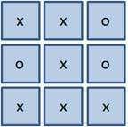

### Функции all() и any()

 Начнем с функции all() и очень простого примера. Предположим, что есть список булевых значений:

> a = [True, True, True, True]

И мы хотим узнать, принимают ли все они значение True? 

Для этого, как раз и используется функция all(), которая на вход принимает итерируемый объект и все его значения приводит к булевым величинам:

> all(a)

Если все значения равны True, то на выходе получаем True. Если же, хотя бы одно значение принимает False, то на выходе будет False:

> all([True, True, False, True])

Но, как вы понимаете, значения в списках могут быть любыми, например, такими:

a = [0, 1, 2.5, "", "python", [], [1, 2], {}]

И к нему тоже можно применить функцию all():
all(a)

Ну и, наверное, самый главный вопрос, где это имеет смысл применять? Давайте представим, что мы делаем игру «Крестики-нолики» и хотели бы на каждом шаге определять, есть ли выигрышная позиция, например, у крестиков? Для простоты сделаем это следующим образом. Все поле из девяти клеток я представлю одномерным списком (сейчас вы узнаете, 
зачем):

> P = ['x', 'x', 'o', 'x', 'x', 'x', 'o', 'x', 'x']


 
Тогда, чтобы проверить выигрышные ситуации по строкам, можно воспользоваться функцией all(), следующим образом:

```python
res1 = all(x == 'x' for x in P[:3])
res2 = all(x == 'x' for x in P[3:6])
res3 = all(x == 'x' for x in P[6:])

print(res1, res2, res3)

```
Смотрите, мы здесь используем вложенный вызов функции `map()`, чтобы правильно преобразовать крестики в True, а нолики – в False, иначе бы все преобразовалось в True. 

Далее, срез для каждой строки на выходе функции map() обрабатывается функцией all() и получаем результат: True – есть выигрышная комбинация; False – нет выигрышной комбинации.

Кстати, из-за дублирования кода – три раза записана одна и та же анонимная функция. 

Для второй функции я приведу такой короткий пример. Предположим, мы делаем игру «Сапер» и игровое поле также представлено в виде одномерного списка длиной NxN элементов:
```python
N = 10
P = [0] * (N*N)
```
Далее, если в этом списке появляется хотя бы одна мина (отметим ее звездочкой):
```python
P[4] = '*'
```
то игрок проигрывает. Чтобы узнать, наступил ли игрок на мину, удобно воспользоваться функцией any():

```python
loss = any(map(lambda x: x == '*', P))
print(loss)
```

После запуска программы увидим значение True, то есть, игрок проиграл. 

А если мину поставить в комментарий и снова запустить, то увидим значение False.


Вот два простых примера, где удобно применять эти две функции any() и all().


