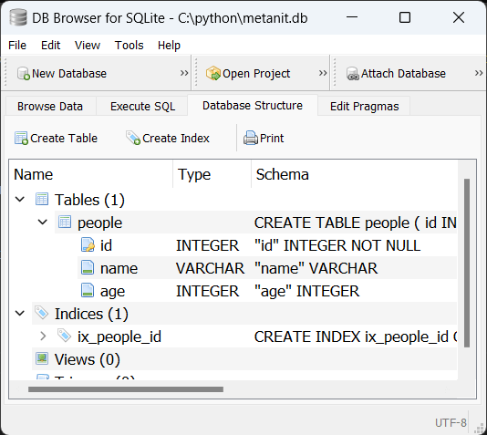

## Определение моделей в ORM SQLAlchemy


Модели представляют классы, которые соответствуют определению таблиц в базе данных и объекты которых хранятся в этих таблицах. 

И одним из преимуществ `SQLAlchemy` является то, что мы можем работать таблицами через эти модели-классы языка Python, не прибегая к созданию запросов на языке `SQL`. 

А `SQLAlchemy` сама сможет сопоставить классы с таблицами, а атрибуты - со столбцами в таблице.

Для создания моделей необходима базовая модель, от которой потом наследуются остальные модели. 

Начиная с версии `SQLAlchemy 2.0` для создания базовой модели надо создать класс, унаследованный от `DeclarativeBase`:

```python
from sqlalchemy.orm import DeclarativeBase
 
class Base(DeclarativeBase): pass
```

### Итак для создания базы данных достаточно

```python
from sqlalchemy import *
from sqlalchemy.orm import *


sqlite_database = "sqlite:///product.db"
engine = create_engine(sqlite_database, echo=True)

class Base(DeclarativeBase): pass

Base.metadata.create_all(bind=engine)
```


Классы, которые наследуются от класса базовой модели, будут сопоставляться с таблицами в базе данных.

 Для сопоставления класса с определенной таблицей в БД применяется атрибут класса `__tablename__`. 

Например, определим модель Person

```python
class Person(Base):
    __tablename__ = "users"
  
    id = Column(Integer, primary_key=True, index=True)
    name = Column(String)
    age = Column(Integer)

```


Итак, класс Person наследуется от базой модели `Base` и проецируется на таблицу `"users"`. То есть объекты класса Person будут храниться в таблице `"users"`.

Для хранения данных в классе модели определяются атрибуты, которые сопоставляются со столбцами таблицы. 

В данном случае класс Person определяет три таких атрибута: `id, name и age`, для которых в таблице `users` будут создаваться одноименные столбцы.

Для опреления атрибутов-столбцов есть разные способы. 

Стандартный способ представляет создание для каждого атрибута-столбца объекта `Column`. 

Класс `Column` с помощью параметров конструктора определяет настройки столбца в таблицы. 

Здесь в конструктор вначале передается тип столбца. Так, у `id` и `age` тип столбца - `Integer`, то есть целое число.

 А столбец `name` представляет тип `String`, то есть строку. Кроме того, в конструктор можно передать ряд дополнительных параметров. 
 
 Так, для столбца `id` передаются параметры `primary_key` и `index`. 
 
 Значение `primary_key=True` указывает, что данный столбец будет представлять первичный ключ. 
 
 А параметр `index=True` говорит, что для данного столбца будет создаваться индекс. 
 
 Стоит отметить, что один из атрибутов-столбцов модели должен представлять первичный ключ, как в примере выше атрибут `id`.

## Определение столбцов

Для определения столбца для класса `Column` можно установить ряд параметров.

Отметим основные:

* `name`: имя столбца. Названия в нижнем регистре считаются регистронезависимыми. Если параметр опущен, то по умолчанию используются названия атрибутов. Это первый позиционный аргумент

* `type_`: тип данных столбца, который задается в виде объекта подкласса `TypeEngine`. Это второй позиционный аргумент

* `autoincrement`: задает автоинкремент значения столбца. 
Может иметь значения `True, False, auto`. Значение `auto` - значение по умолчанию, которое говорит, что стобец первичного ключа с типом INTEGER будет автоматически увеличивать свое значение при добавлении нового объекта в таблицу. 

Данный параметр применяется только для столбцов с типами INT, SMALLINT, BIGINT.

* `default`: устанавливает значение по умолчанию


* index: если равен `True`, то для столбца будет создаваться индекс


* `nullable`: если равен `False`, то к определению столбца в бд будет добавляться ограничение `NOT NULL`. Для всех столбцов, кроме столбца первичного ключа, значение по умолчанию - `True`

* `primary_key`: если равен `True`, то столбец будет считаться первичным ключом

* `unique`: если равен `True`, то для столбца будет создаваться ограничение `UNIQUE`, благодаря чему столбец будет поддерживать только уникальные значения

В качестве типов для столбцов можно использовать один из следующих встроенных типов:

* `BigInteger`: целые числа

* `Boolean`: булевый тип

* `Date`: объект `datetime.date()`

* `DateTime`: объект `datetime.datetime()`

* `Enum`: тип `Enum`

* `Float`: тип для чисел с плавающей точкой, например, `FLOAT и REAL`.

* `Integer`: целые числа

* `Interval`: объект `datetime.timedelta()`

* `LargeBinary`: большие наборы байтов

* `MatchType`: соответствует результату оператора `MATCH`.

* `Numeric`: базовый тип для дробных числовых данных, например, `NUMERIC, FLOAT, DECIMAL`.

* `PickleType`: для объектов `Python`, которые сериализованы с помощью модуля `pickle`.

* `SmallInteger`: целые числа

* `String`: строки

* `Text`: строки произвольной длины.

* `Time`: объект `datetime.time()`

* `Unicode`: строка символов `Unicode` произвольной длины.

* UnicodeText: строка Unicode неограниченной длины.

## Создание базы данных и таблиц


Для создания базы данных и таблиц по метаданным моделей применяется метод `Base.metadata.create_all()`.

Его ключевой параметр - `bind` принимает класс, который используется для подключения к базе данных. 

В качестве такого класса применяется созданный ранее движок `SQLAlchemy`. 

Если база данных и все необходимые таблицы уже имеются, то метод не создает заново таблицы.

Например, создадим таблицу users по выше определенной модели Person:

```python
Base.metadata.create_all(bind=engine)
print("База данных и таблица созданы")
```


Листинг кода
```python
from sqlalchemy import *
from sqlalchemy.orm import *


sqlite_database = "sqlite:///product.db"
engine = create_engine(sqlite_database, echo=True)

class Base(DeclarativeBase): pass

class Person(Base):
    __tablename__ = "users"
    id = Column(Integer, primary_key=True, index=True)
    name = Column(String)
    age = Column(Integer,)

Base.metadata.create_all(bind=engine)


```