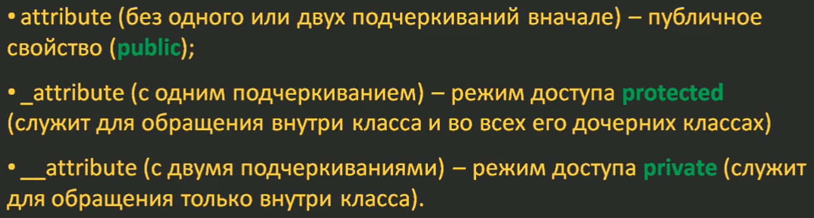

## Наследование. Атрибуты private и protected при наследовании

как влияет режим доступа `private` и `protected` атрибутов при наследовании классов?

Ранее мы с вами об этом уже говорили и в частности отмечали, что:

`_attribute` (с одним подчеркиванием) – режим доступа `protected` (служит для обращения внутри класса и во всех его дочерних классах)
`__attribute` (с двумя подчеркиваниями) – режим доступа `private` (служит для обращения только внутри класса).



Давайте посмотрим, как ведут себя атрибуты с этими режимами доступа при наследовании. 

Возьмем пример из предыдущего занятия с двумя классами:

```python
class Point:

    def __init__(self, x, y):
        self.__x = x
        self.__y = y

    def __repr__(self):
        return f'Я точка: {self.__x} x {self.__y}'


    def move_by(self, x, y):
        self.__x += x
        self.__y += y


class Point3D(Point):

    def __init__(self, x, y, z):
        self.__z = z
        super().__init__(x, y)


    def move_by(self, x, y, z):
        self.__z = + z
        super().move_by(x, y)

    def __repr__(self):
        s = super().__repr__()
        return f'{s} x {self.__z}'


p = Point(1, 2)
print(p)
p3d = Point3D(10, 20, 30)
print(p3d)


p3d.move_by(50, 50, 50)
print(p3d)
p.move_by(50, 50)
print(p)
```

Те же ограничения доступа можно накладывать и на методы. 

Если в базовом классе Geom определить приватный метод, например, для проверки корректности значений координат:

```python

class Point:

    def __init__(self, x, y):
       
        self.__x = x if self.__verify_coord(x) else 0    
        self.__y = y

    def __repr__(self):
        return f'Я точка: {self.__x} x {self.__y}'

   
    def move_by(self, x, y):
        self.__x += x
        self.__y += y

    def __verify_coord(self, coord):
        return 0 <= coord <= 100

class Point3D(Point):

    def __init__(self, x, y, z):
        # super().__verify_coord(x) ## не работает
        self.__z = z
        super().__init__(x, y)
```


## Вспомним про геттеры
```python
 @property
    def x(self):
        return self.__x


```


### Как хакнуть private

Легко  можно хакнуть и приватные свойства у класса нашей точки
```python
point.__class__.__secret_key
```


```python
print(dir(p))
print(p._Point__secret)
print(p._Point__x)
print(p.__Point__verify_coord)
```

Если у вас появилась необходимость лучше защитить методы класса от доступа извне, то это можно сделать с помощью модуля accessify. Для его установки нужно выполнить команду:

`pip install accessify`

И, затем, импортировать из него два декоратора:

from accessify import private, protected
Далее, нужный декоратор просто применяем к методу и он становится либо приватным (private), либо защищенным (protected):

```python
    @private
    @classmethod
    def __verify_coord(cls, coord):
        return 0 <= coord <= 100
```

### Выводы
