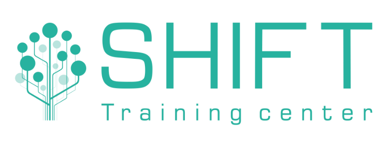
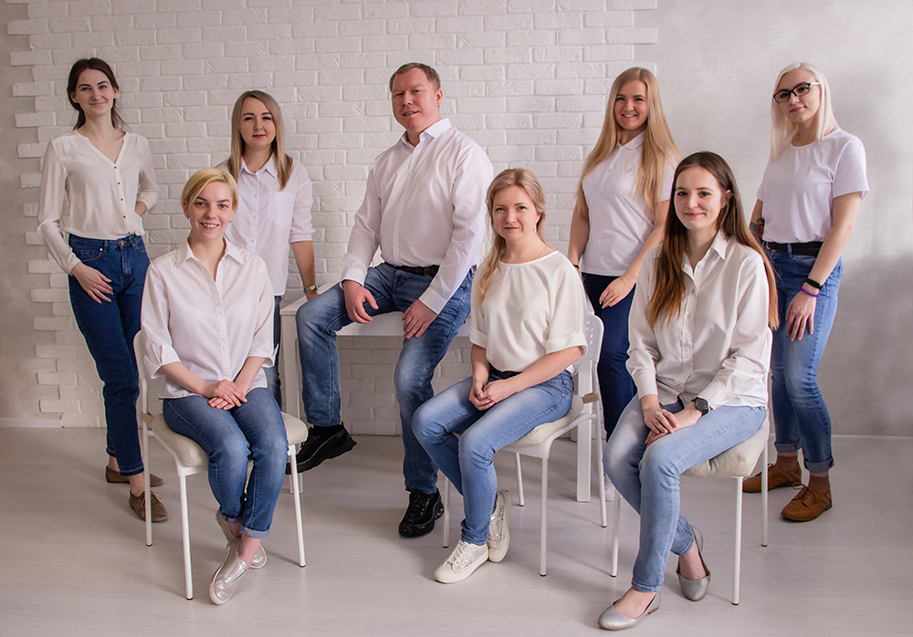

# Программирование на языке Python. 
## Уровень 2. Продвинутый курс.
### (программа идентична для дистанционного и очного обучения)

## Модуль 1. Функциональное программирование

*	Функция как объект. Паттерн «Фабрика функций»
*	Анонимные функции. Сортировка коллекций по ключу
*	Применение функций `all` и `any`
*	Функции высшего порядка (`map, filter, reduce`)
*	Модуль `itertools` и комбинаторика
*	Практические задачи

## Модуль 2. Замыкания и функции декораторы

*	Глобальный и локальный контекст
*	Замыкания функций
*	Декораторы функций
*	Встроенные декораторы
*	Функция-генератор. Оператор `yield`
*	Практические задачи

## Модуль 3. Алгоритмы

*	Жадные алгоритмы
*	Алгоритмы на графах
*	Алгоритмы поиска `(BFS, DFS, Dijkstra)`
*	Понятие сложности алгоритма
*	Практические задачи

## Модуль 4. Введение в ООП
*	Эволюция парадигм программирования и актуальность ООП
*	Класс и экземпляр класса
*	Методы классов
*	Конструктор класса
*	Инкапсуляция и доступ к содержимому класса
*	Практические задачи

## Модуль 5. Предопределённые магические (dunder) методы в ООП

*	Метод `__call__`. Функторы и классы-декораторы
*	Метод `__new__`. Паттерн синглетон
*	Паттерн matching
*	Слоты. Коллекция `__slots__`
*	Паттерн моносостояние
*	Практические задачи

## Модуль 6. Магические методы и перегрузка операторов

*	Магические методы `__add__, __sub__, __mul__`
*	Методы сравнений `__eq__, __ne__, __lt__, __gt__` 
*	Магические методы `__eq__ и __hash__`
*	Магический метод `__bool __` определения правдивости объектов
*	Магические методы `__getitem__, __setitem__ и __delitem__`
*	Генераторы и итераторы. Магические методы `__iter__ и __next__`
*	Практические задачи

## Модуль 7. Наследование 

*	Понятия базового класса и производного класса. Утиная типизация
*	Наследование от встроенных типов
*	Атрибуты `private и protected` при наследовании. 
*	Практические задачи

## Модуль 7. Полифорфизм и абстрактные классы. 

*	Суть полиморфизма
*	Абстрактные методы
*	Класс Enum
*	Методы класса и статические методы
*	Практические задачи

## Модуль 8. Множественное наследование и абстракция 

*	Множественное наследование
*	Миксины
*	Декрипторы классов
*	Абстрактные классы
*	Наследование исключений
*	Менеджеры контекстов. Оператор `with`
*	Практические задачи

## Модуль 9. Отношения между классами. Понятие об объектно-реляционном соответствии

*	Библиотечный модуль `pickle`. Применение
*	Концепция композиции и агрегации
*	Применение объектно-реляционного отображения. 
*	Отношения между классами на примере работы c ORM `SQLAlchemy`
*	Практические задачи

## Модуль 10. Концепции ОО-проектирования. ОО-дизайн

*	Вложенные классы
*	Пользовательские мета-классы. Объект type
*	Декорирование классами
*	Применение dataclasses
*	Дескрипторы классов
*	Принципы проектирования `Solid`
*	Итоговая практическая работа

# Учебный центр "Шифт"

Учебный центр «ШИФТ» специализируется на обучении IT специалистов, обучает мировым лидерам IT-отрасли, готовит специалистов высокого класса к реальной практической работе.

За это время было разработано более 100 специализированных курсов: для программистов, системных администраторов, системных аналитиков, разработчиков и т.д.

Кроме этого, Школа информационных и финансовых технологий подготавливает профессионалов по направлению автоматизированного проектирования, обучает офисный персонал организации, и проводит тренинги, начиная от малого бизнеса заканчивая корпорациями. 

Преподаватели учебного центра вкладывают все свои знания, умения и навыки с огромным практическим опытом в каждого слушателя.

Учебные классы полностью укомплектованы оборудованием для комфортного обучения, оснащены современной техникой и презентационным оборудованием.

[https://www.eshift.ru/o-nas/uchebnyy-tsentr-shift/](https://www.eshift.ru/o-nas/uchebnyy-tsentr-shift/)